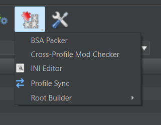
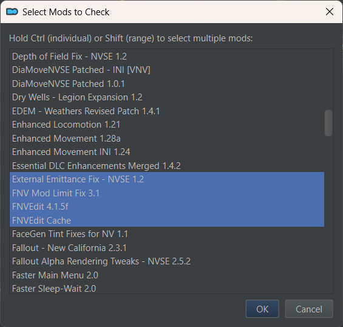
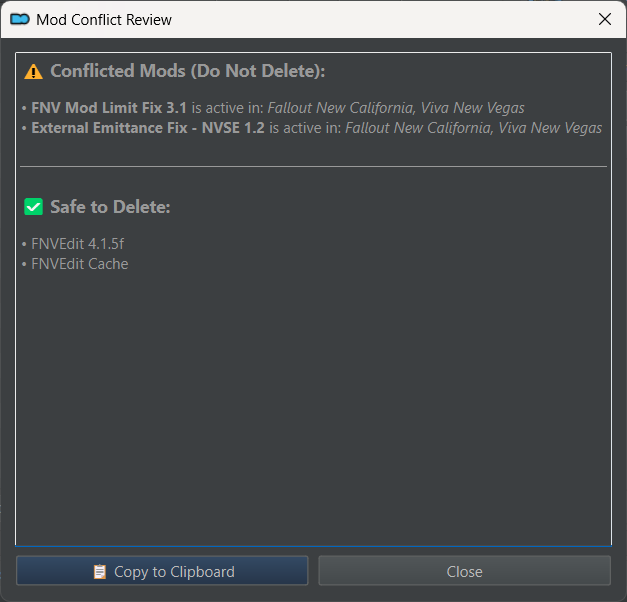

# Cross-Profile Mod Checker for Mod Organizer 2

This is a Mod Organizer 2 plugin that checks if a selected mod is enabled in other profiles and indicates whether it is safe to delete or what profiles it is used in.  I install multiple copies of the same mod (by version) and I use this plugin to see what profiles need to be upgraded to the newer version and clean up the mod list.

## How to install

Extract the archive in Mod Organizer 2's plugins folder, as show below:

```text
dlls/
plugins/
  data/
  profile_checker/
    __init__.py
    profile_checker.py
  ...
```

## How to use

* Use the tools menu and select Cross-Profile Mod Checker:



* Select a mod from the list, use ctrl or shift to select multiple mods and click OK.



* A report dialogue will show up with a list of mods deemed to be conflicting and safe to delete:


